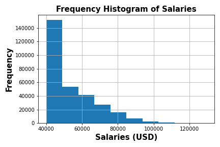
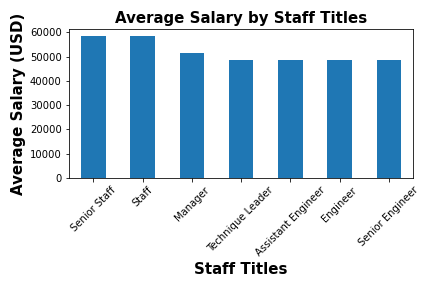

# sql_challenge - Employee Database Modelling
Data Modelling and Engineering, using ERD diagrams, and sqlalchemy


## Background

As a Data engineer, the first major task is a research project on 'employees' of the corporation from the 1980s and 1990s. All that remain of the database of employees from that period are six CSV files located in the ***data*** folder.

In this assignment, you will design the tables to hold data in the CSVs, import the CSVs into a SQL database, and answer questions about the data. In other words, you will perform:

1. Data Modeling and Data Engineering

2. Data Analysis

### Set Up

1. Created a new repository for this project called `sql-challenge`. 

2. Cloned the new repository to local computer.

3. Inside the local git repository, created a directory for the SQL challenge. Used a folder name to correspond to the challenge: **EmployeeSQL**.

4. Added files to this folder.

5. Pushed the above changes to GitHub.


#### Data Modeling and Engineering

Inspected the CSVs and sketched out an ERD of the tables. Used a tool : [http://www.quickdatabasediagrams.com](http://www.quickdatabasediagrams.com).

* Used the information to create a table schema for each of the six CSV files. Remembered to specify data types, primary keys, foreign keys, and other constraints.

  * For the primary keys checked to see if the column is unique, otherwise created a [composite key](https://en.wikipedia.org/wiki/Compound_key). Which takes two primary keys in order to uniquely identify a row.
  * Created tables in the correct order to handle foreign keys.

* Imported each CSV file into the corresponding SQL table. **Note** imported the data in the same order that the tables were created and accounted for the headers when importing to avoid errors.

#### Data Analysis

Completed database, did the following:

1. Listed the following details of each employee: employee number, last name, first name, sex, and salary.

2. Listed first name, last name, and hire date for employees who were hired in 1986.

3. Listed the manager of each department with the following information: department number, department name, the manager's employee number, last name, first name.

4. Listed the department of each employee with the following information: employee number, last name, first name, and department name.

5. Listed first name, last name, and sex for employees whose first name is "Hercules" and last names begin with "B."

6. Listed all employees in the Sales department, including their employee number, last name, first name, and department name.

7. Listed all employees in the Sales and Development departments, including their employee number, last name, first name, and department name.

8. In descending order, listed the frequency count of employee last names, i.e., how many employees share each last name.

## Additional Analysis

1. Imported the SQL database into Pandas. 

   ```sql
   from sqlalchemy import create_engine
   engine = create_engine('postgresql://localhost:5432/<your_db_name>')
   connection = engine.connect()
   ```

* Consulted [SQLAlchemy documentation](https://docs.sqlalchemy.org/en/latest/core/engines.html#postgresql) for more information.

* If using a password, do not upload your password to your GitHub repository. See [https://www.youtube.com/watch?v=2uaTPmNvH0I](https://www.youtube.com/watch?v=2uaTPmNvH0I) and [https://help.github.com/en/github/using-git/ignoring-files](https://help.github.com/en/github/using-git/ignoring-files) for more information.

2. Created a histogram to visualize the most common salary ranges for employees.
 
    

3. Created a bar chart of average salary by title.

    


## List of Content

* Created an image file of your ERD.

* Created a `.sql` file of your table schemata.

* Created a `.sql` file of your queries.

* Created a Jupyter Notebook for further analysis.

* Created and uploaded a repository with the above files to GitHub a

* Ensured repository had regular commits and a thorough README.md file


- - -

## References

Mockaroo, LLC. (2021). Realistic Data Generator. [https://www.mockaroo.com/](https://www.mockaroo.com/)

- - -

© 2021 Trilogy Education Services, LLC, a 2U, Inc. brand. Confidential and Proprietary. All Rights Reserved.

Copyright
S Kennedy @2021. All rights reserved.

